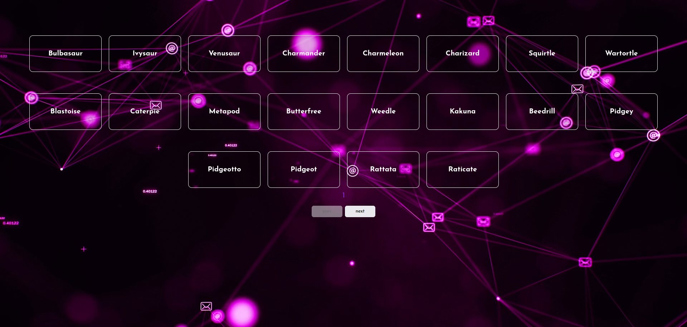

# Сайт с REST API Pokemon

## Описание

Этот проект представляет собой веб-сайт, который использует REST API для получения данных о покемонах. Сайт отображает информацию о различных покемонах, и пользователь может исследовать и изучать характеристики каждого покемона.

### Основные функции

- Отображение списка покемонов с именами.
- Детальные страницы для каждого покемона с информацией о его типе, способностях и статистике.
- Интерактивная навигация и удобный интерфейс.

## Технологии

- JavaScript - для запросов к REST API и динамического отображения данных.
- HTML/CSS - для структуры и стилизации веб-страницы.
- REST API - для получения данных о покемонах.

## Запуск проекта

Этот проект работает в любом современном веб-браузере и не требует настройки локального окружения. Вы можете просто открыть файл `index.html` в вашем браузере.